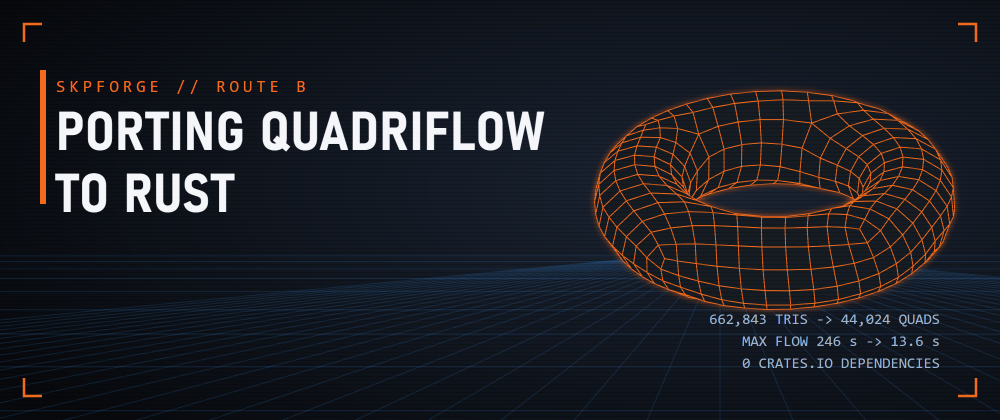

Tenía una regla, y QuadriFlow no la cumplía.

En skpforge, la herramienta que estoy construyendo para llevar modelos de SketchUp a Unreal Engine 5, nada entra desde crates.io, y toda librería en C o C++ se lee antes de entrar al repositorio. QuadriFlow, la herramienta de retopología automática que necesitaba para sacar mallas de cuadriláteros, compila contra Boost y Eigen. No podía decir con honestidad que los había leído. Así que lo porté a Rust.

Leer el código de otro te muestra la distancia entre lo que dice hacer y lo que hace. Una división de vértices que nunca se ejecuta, porque quedó después de un `return`. Y dos errores que, en modelos de SketchUp llenos de muros que se encuentran en T, lo dejan colgado o lo hacen salir sin resultado. En una casa de prueba, el original quedó pegado hasta que lo mató un *timeout* de 600 segundos. El port la resuelve en 1,2 segundos.

¿Lo que más me enseñó? El flujo máximo. Probé Dinic, el algoritmo con mejor cota en el libro, y fue más lento. Boykov-Kolmogorov, el que QuadriFlow usa de verdad en estos casos, bajó esa etapa de 246 a 13,6 segundos en un modelo de 662.843 triángulos.

La mejor cota perdió. Ganó medir.

Escribí el proceso completo, con los números, en dev.to.

El link está en la descripción.

